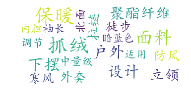
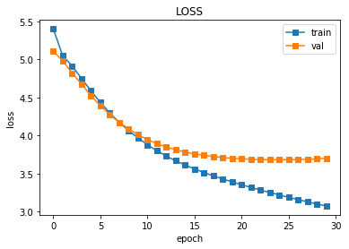

```python
# 查看当前挂载的数据集目录, 该目录下的变更重启环境后会自动还原
# View dataset directory. 
# This directory will be recovered automatically after resetting environment. 
!ls /home/aistudio/data
```

    data128633


```python

```

# 作业评分说明
- [x] 1.格式规范（有至少3个小标题，内容完整），一个小标题5分，最高20分
- [x] 2.图文并茂，一张图5分，最高20分
- [x] 3.有可运行的代码，且代码内有详细注释，20分
- [x] 4.代码开源到github，15分
- [x] 5.代码同步到gitee，5分

# 作业内容

## 一、项目背景介绍

该部分主要向大家介绍你的项目目前社会研究情况，研究热度，或者用简短精炼的语言让大家理解为什么要做出这个项目
### 1.选择[文案营销数据集](https://aistudio.baidu.com/aistudio/datasetdetail/128633)数据集
自己的数据集 数据来源是文案营销数据集（5万组数据）
### 2.项目背景/意义重大
对于社媒营销系统来说，文案的编写是费人费事的，而现在NLP的生成很强大，所以采用生成模型减轻人工的工作，节省人力成本。


## 二、数据介绍
数据来源是文案营销数据集（5万组数据）。
### 1.总览：
数据格式如下：


### 2.查看和预处理

#### 2.2.1 linux查看数据


```python
# 查看数据
!ls /home/aistudio/data/data128633/
!ls /home/aistudio/work
!ls /home/aistudio/data/data128633/
!tree  /home/aistudio/data/data128633/
!head -21  /home/aistudio/data/data128633/服饰数据.json
```

    服饰_50k.json  服饰数据.json
    服饰_50k.json  服饰数据.json
    /home/aistudio/data/data128633/
    ├── 服饰_50k.json
    └── 服饰数据.json
    
    0 directories, 2 files
    {
        "1": {
            "title": "巴拉巴 拉 旗下 梦 多多 童装 男童 毛衫 冬季 中大童 毛衫 黑色",
            "kb": {
                "适用季节": "冬季",
                "厚度": "适中",
                "领型": "高领",
                "适用年龄": "9-12岁",
                "材质成分": "锦纶",
                "图案": "其它",
                "上市时间": "2018冬季",
                "面料": "其它",
                "风格": "休闲风",
                "衣门襟": "套头",
                "适用性别": "男",
                "安全等级": "B类",
                "毛线粗细": "普通毛线"
            },
            "ocr": "中国蓝，深土黄，健康安全，A门襟，黑色，衣袖，面料展，产品信息，领口，可水洗，细节展示，不宜暴晒，不可漂白，短拉链设计，简洁实用，吊牌价:239.00，适合季节:秋冬季，半开领设计，舒适亲肤，]面料构成，田属性说明，不可源自，合格证，不可干流",
            "reference": "三合一混纺纱线制成，柔软亲肤，贴身穿也没有扎感。半开领的立领设计，在较凉的天气，保护脖颈，穿脱也更为方便。侧袖的拼接撞色设计，凸现个性，宝宝穿上更帅气。"
        },


#### 2.2.2 数据预处理和分割数据集


```python
# 在可视化之前，首先先把数据预处理一下，并分出数据集
import json
import jieba
samples = set()
# Read json file.
json_path = '/home/aistudio/data/data128633/服饰_50k.json'
with open(json_path, 'r', encoding='utf8') as file:
    jsf = json.load(file)
for jsobj in jsf.values():
    title = jsobj['title'] + ' '  # Get title.
    kb = dict(jsobj['kb']).items()  # Get attributes.
    kb_merged = ''
    for key, val in kb:
        kb_merged += key+' '+val+' '  # Merge attributes.
    ocr = ' '.join(list(jieba.cut(jsobj['ocr'])))  # Get OCR text.
    texts = []
    texts.append(title + ocr + kb_merged)  # Merge them.
    reference = ' '.join(list(jieba.cut(jsobj['reference'])))
    for text in texts:
        text=text.replace('\t',' ').replace('、','').replace('”','').replace('(','').replace(')','').replace(';',' ').replace('“',' ').replace('°',' ').replace('，','').replace('。\n',' ').replace(':',' ').replace('。',' ').replace('：','').replace('/',' ').replace('  ',' ').replace('  ',' ') 
        reference=reference.replace('\t',' ').replace('、','').replace('”','').replace('(','').replace(')','').replace(';',' ').replace('“',' ').replace('°',' ').replace('，','').replace('。\n',' ').replace(':',' ').replace('。',' ').replace('：','').replace('/',' ').replace('  ',' ').replace('  ',' ') 
        sample = text+'\t'+reference  # Seperate source and reference.
        samples.add(sample)
print(len(samples))
with open('/home/aistudio/data/data128633/服饰_50k.txt', 'w', encoding='utf8') as file:
    for line in samples:
        file.write(line)
        file.write('\n')
import random
with open('/home/aistudio/work/train_50k.txt', 'w', encoding='utf8') as trainf, open('/home/aistudio/work/dev_50k.txt', 'w', encoding='utf8') as devf, open('/home/aistudio/work/test_50k.txt', 'w', encoding='utf8') as testf:
    for line in samples:
        tmp=random.random()
        if tmp<0.7:
            trainf.write(line)
            trainf.write('\n')
        elif  tmp<0.9:
            devf.write(line)
            devf.write('\n')
        else:
            testf.write(line)
            testf.write('\n')
```

    Building prefix dict from the default dictionary ...
    Dumping model to file cache /tmp/jieba.cache
    Loading model cost 0.864 seconds.
    Prefix dict has been built successfully.


    49996


#### 2.2.3 词云展示


```python
!pip install wordcloud
# 安装词云，并打印数据，查看一下分布
```

    Looking in indexes: https://pypi.tuna.tsinghua.edu.cn/simple
    Collecting wordcloud
      Downloading https://pypi.tuna.tsinghua.edu.cn/packages/1b/06/0516bdba2ebdc0d5bd476aa66f94666dd0ad6b9abda723fdf28e451db919/wordcloud-1.8.1-cp37-cp37m-manylinux1_x86_64.whl (366 kB)
         |████████████████████████████████| 366 kB 7.9 MB/s            
    [?25hRequirement already satisfied: pillow in /opt/conda/envs/python35-paddle120-env/lib/python3.7/site-packages (from wordcloud) (8.2.0)
    Requirement already satisfied: matplotlib in /opt/conda/envs/python35-paddle120-env/lib/python3.7/site-packages (from wordcloud) (2.2.3)
    Requirement already satisfied: numpy>=1.6.1 in /opt/conda/envs/python35-paddle120-env/lib/python3.7/site-packages (from wordcloud) (1.19.5)
    Requirement already satisfied: pyparsing!=2.0.4,!=2.1.2,!=2.1.6,>=2.0.1 in /opt/conda/envs/python35-paddle120-env/lib/python3.7/site-packages (from matplotlib->wordcloud) (3.0.7)
    Requirement already satisfied: python-dateutil>=2.1 in /opt/conda/envs/python35-paddle120-env/lib/python3.7/site-packages (from matplotlib->wordcloud) (2.8.2)
    Requirement already satisfied: six>=1.10 in /opt/conda/envs/python35-paddle120-env/lib/python3.7/site-packages (from matplotlib->wordcloud) (1.16.0)
    Requirement already satisfied: cycler>=0.10 in /opt/conda/envs/python35-paddle120-env/lib/python3.7/site-packages (from matplotlib->wordcloud) (0.10.0)
    Requirement already satisfied: pytz in /opt/conda/envs/python35-paddle120-env/lib/python3.7/site-packages (from matplotlib->wordcloud) (2019.3)
    Requirement already satisfied: kiwisolver>=1.0.1 in /opt/conda/envs/python35-paddle120-env/lib/python3.7/site-packages (from matplotlib->wordcloud) (1.1.0)
    Requirement already satisfied: setuptools in /opt/conda/envs/python35-paddle120-env/lib/python3.7/site-packages (from kiwisolver>=1.0.1->matplotlib->wordcloud) (56.2.0)
    Installing collected packages: wordcloud
    Successfully installed wordcloud-1.8.1
    WARNING: You are using pip version 21.3.1; however, version 22.0.3 is available.
    You should consider upgrading via the '/opt/conda/envs/python35-paddle120-env/bin/python -m pip install --upgrade pip' command.


```python
# jieba进行文本数据的分词 #这一步不需要做，因为上面数据处理中已经有了
import jieba
from jieba import analyse
# 词云可视化
from wordcloud import WordCloud
import matplotlib.pyplot as plt  
with open('/home/aistudio/data/data128633/服饰_50k.txt', mode='r', encoding='utf-8') as f:
    text = f.readlines()
def tongji(lines,index):    
    print(f'========第{index}条数据=====')
    # print('/ '.join(lines[index].split(' ')))
    extract_tags = analyse.extract_tags(lines[index], withWeight=True)
    for i, j in extract_tags:
        pass #print(i, j)
    result = {}
    for word in extract_tags:
        result[word[0]] = word[1]
    wordcloud = WordCloud(
        background_color="white",
        max_font_size=50,
        font_path='/home/aistudio/work/simkai.ttf')
        #
    wordcloud.generate_from_frequencies(result)

    plt.figure()
    plt.axis('off')
    plt.imshow(wordcloud)
    plt.show()

# !pip install wordcloud
```


```python
tongji(text,1)
tongji(text,2)
tongji(text,3)
tongji(text,4)
tongji(text,5)
```

    ========第1条数据=====


    

    


    ========第2条数据=====


    

    


    ========第3条数据=====


    

    


    ========第4条数据=====


    

    


    ========第5条数据=====


    

    


#### 2.2.4 为模型构建词典等统计数据


```python
#这边多统计一些数据
# 50k的词汇的dic
from collections import Counter
word_c={}
lenx=[]
leny=[]
word2count = Counter()
# with open('/home/aistudio/data/data128633/sam服饰数据.txt', mode='r', encoding='utf-8') as f:
with open('/home/aistudio/data/data128633/服饰_50k.txt', mode='r', encoding='utf-8') as f:
    texts = f.readlines()
    for line in texts:
        # print(line)
        line=line
        ss=line.split('\t')
        if len(ss)!=2:continue
        xlst,ylst=ss[0].strip().split(" ") ,ss[1].strip().split(" ")
        # print(xlst,ylst)
        lenx.append(len(xlst))
        leny.append(len(ylst))
        for i in xlst+ylst:
            if i in word_c.keys():
                word_c[i]=word_c[i]+1
            else:
                word_c[i]=1
print(max(lenx),max(leny))
print(len(word_c))
# 将这个词典中的词，按照出现次数排序，出现次数越高，排序越靠前
# 一般来说，出现频率高的高频词往往是：I，the，you这种代词，而出现频率低的词，往往是一些名词，如：nlp
word_freq_dict = sorted(word_c.items(), key = lambda x:x[1], reverse = True)
# 构造3个不同的词典，分别存储，
# 每个词到id的映射关系：word2id_dict
# 每个id到词的映射关系：id2word_dict
#word2id_dict.get('<start>')
word2id_dict = {'<pad>':0,'<unk>':1,'<start>':2}
id2word_dict = {0:'<pad>',1:'<unk>',2:'<start>'}
# 按照频率，从高到低，开始遍历每个单词，并为这个单词构造一个独一无二的id
frequency=4 #共计95755个词，超过4个频率的词是31609
for word, freq in word_freq_dict:
    if freq>frequency:
        curr_id = len(word2id_dict)
        word2id_dict[word] = curr_id
        id2word_dict[curr_id] = word
    else:
        word2id_dict[word]=1
print("超过4个频率的词:",len(id2word_dict)-3)
print("共计:",len(word2id_dict)-3)
print("前5个高频词：",word_freq_dict[:5])
# baocun
import pickle
def save_obj(obj, name ):
    with open('/home/aistudio/work/obj-'+name+'.pkl', 'wb') as f:
        pickle.dump(obj, f, pickle.HIGHEST_PROTOCOL)

def load_obj(name ):
    with open('/home/aistudio/work/obj-' + name + '.pkl', 'rb') as f:
        return pickle.load(f)
save_obj(word_freq_dict,"word_freq_dict")
save_obj(word2id_dict,"word2id_dict")
save_obj(id2word_dict,"id2word_dict")
print(load_obj("word_freq_dict")[:6])
```

    276 56
    95755
    超过4个频率的词: 31609
    共计: 95755
    前5个高频词： [('的', 324132), ('设计', 111486), ('面料', 107355), ('舒适', 86106), ('展示', 59808)]
    [('的', 324132), ('设计', 111486), ('面料', 107355), ('舒适', 86106), ('展示', 59808), ('指数', 55554)]


### 3.数据集类的定义（继承paddle.io.Dataset的类）


```python
import paddle
print(paddle.vision)
```

    <module 'paddle.vision' from '/opt/conda/envs/python35-paddle120-env/lib/python3.7/site-packages/paddle/vision/__init__.py'>


```python
import sys 
sys.path.append('/home/aistudio/external-libraries')
import numpy as np
import pickle
import paddle
import paddle.vision.transforms as T
print("---")
class MyYingxiaoDataset(paddle.io.Dataset):
    def __init__(self,
                 file_path='/home/aistudio/data/data128633/服饰数据_50k.txt', #抽样
                 x_max_len=240, # x最大长度
                 y_max_len=50, # y最大长度
                 word2id_dict_pkl_path='work/obj-word2id_dict.pkl' # pkl的路径
                 ):
        super(MyYingxiaoDataset, self).__init__()
        self.x =[]  # x数据
        self.y=[] #y数据
        self.xl =[]  # x有效长度数据
        self.yl= [] #y有效长度数据
        word2id_dict={}
        print("预设填充或截断的XY长度：",x_max_len,y_max_len)
        with open(word2id_dict_pkl_path, 'rb') as f:
            word2id_dict= pickle.load(f)
        with open(file_path, mode='r', encoding='utf-8') as f:
        # with open('/home/aistudio/data/data128633/服饰_50k.txt', mode='r', encoding='utf-8') as f:
            texts = f.readlines()
            for line in texts:
                # print(line)
                line=line
                ss=line.split('\t')
                if len(ss)!=2:continue
                xlst,ylst=ss[0].strip().split(" ") ,ss[1].strip().split(" ")
                xid=[ word2id_dict.get(v, 0)  for v in xlst]+[0]*x_max_len
                yid=[ word2id_dict.get(v, 0)  for v in ylst]+[0]*y_max_len
                self.x.append(xid[:x_max_len])
                self.y.append(yid[:y_max_len])
                self.xl.append(min(x_max_len,len(xlst)))
                self.yl.append(min(y_max_len,len(ylst)))
        self.lenall=len(self.xl)
        print('样本数目：',self.lenall)

    def __getitem__(self, index):
        return paddle.to_tensor(self.x[index]),paddle.to_tensor(self.xl[index]),paddle.to_tensor(self.y[index]),paddle.to_tensor(self.yl[index])

    def __len__(self):
        return self.lenall
```

    ---


```python
print(paddle.vision)
file_path='/home/aistudio/work/dev_50k.txt'
x_max_len=240 # x最大长度
y_max_len=30 # y最大长度
train_dataset = MyYingxiaoDataset( file_path=file_path,
                 x_max_len=x_max_len, # x最大长度
                 y_max_len=y_max_len, # y最大长度
                 word2id_dict_pkl_path='work/obj-word2id_dict.pkl' # pkl的路径
                 )

index=9
with open(file_path, mode='r', encoding='utf-8') as f:
    texts = f.readlines()[index]
xs,ys=texts.split('\t')
print("预设填充或截断的XY长度：",x_max_len,y_max_len)
print("原始某条数据的XY长度：",len(xs.strip().split(" ")),len(ys.strip().split(" ")))
x,xl,y,yl = train_dataset[index]
print("Dataset某条数据的XY长度：",xl,yl)
print("Dataset某条填充或截断后数据的XY长度：",x.shape,y.shape)
print(len(train_dataset))
print(x,xl,y,yl)
for x,xl,y,yl in train_dataset:
    print(x.shape,xl.shape,y.shape,yl.shape)
    break
```

    <module 'paddle.vision' from '/opt/conda/envs/python35-paddle120-env/lib/python3.7/site-packages/paddle/vision/__init__.py'>
    预设填充或截断的XY长度： 240 30
    样本数目： 9993
    预设填充或截断的XY长度： 240 30
    原始某条数据的XY长度： 211 29
    Dataset某条数据的XY长度： Tensor(shape=[1], dtype=int64, place=CPUPlace, stop_gradient=True,
           [211]) Tensor(shape=[1], dtype=int64, place=CPUPlace, stop_gradient=True,
           [29])
    Dataset某条填充或截断后数据的XY长度： [240] [30]
    9993
    Tensor(shape=[240], dtype=int64, place=CPUPlace, stop_gradient=True,
           [3263, 755 , 65  , 1446, 308 , 362 , 56  , 371 , 24  , 1380, 659 , 2935,
            35  , 3263, 113 , 2223, 127 , 906 , 829 , 1931, 5211, 869 , 2577, 2101,
            13  , 7   , 25  , 374 , 25  , 7   , 351 , 2184, 906 , 829 , 251 , 26  ,
            897 , 709 , 2977, 1225, 2730, 3225, 386 , 327 , 43  , 613 , 1877, 734 ,
            740 , 144 , 659 , 859 , 177 , 96  , 1908, 38  , 19  , 276 , 280 , 10  ,
            122 , 906 , 829 , 47  , 4   , 357 , 3   , 145 , 55  , 336 , 507 , 3   ,
            56  , 561 , 495 , 351 , 210 , 225 , 829 , 1312, 1181, 64  , 29  , 1931,
            659 , 423 , 2545, 46  , 76  , 1027, 717 , 829 , 155 , 166 , 11  , 24  ,
            3   , 113 , 280 , 96  , 109 , 285 , 1225, 6084, 2730, 3225, 5532, 27  ,
            4054, 1089, 7120, 1457, 131 , 48  , 1793, 829 , 613 , 2492, 229 , 12758,
            2003, 911 , 15  , 452 , 18117, 10746, 4   , 6819, 87  , 538 , 567 , 8504,
            210 , 225 , 1312, 10747, 14  , 63  , 27  , 332 , 633 , 56  , 755 , 2998,
            11104, 900 , 1145, 6001, 1724, 8138, 611 , 3   , 6214, 38  , 20638, 3   ,
            9739, 8822, 1297, 18854, 4   , 1454, 33  , 1   , 35  , 1312, 277 , 829 ,
            277 , 3818, 11104, 12051, 917 , 14575, 1285, 1348, 18118, 906 , 43  , 351 ,
            2231, 13558, 475 , 33  , 2088, 10145, 3   , 28634, 369 , 14229, 41  , 1   ,
            3423, 148 , 4769, 2012, 3197, 27  , 3263, 2742, 2250, 2170, 3887, 21  ,
            490 , 44  , 160 , 2284, 1   , 2261, 15349, 0   , 0   , 0   , 0   , 0   ,
            0   , 0   , 0   , 0   , 0   , 0   , 0   , 0   , 0   , 0   , 0   , 0   ,
            0   , 0   , 0   , 0   , 0   , 0   , 0   , 0   , 0   , 0   , 0   , 0   ]) Tensor(shape=[1], dtype=int64, place=CPUPlace, stop_gradient=True,
           [211]) Tensor(shape=[30], dtype=int64, place=CPUPlace, stop_gradient=True,
           [29 , 11 , 127, 906, 829, 4  , 650, 3968, 346, 131, 7121, 606, 709, 3  ,
            3115, 155, 371, 713, 492, 1446, 308, 3  , 63 , 1227, 112, 4167, 538, 159,
            6  , 0  ]) Tensor(shape=[1], dtype=int64, place=CPUPlace, stop_gradient=True,
           [29])
    [240] [1] [30] [1]


## 四 模型训练
### 1.数据处理

#### 4.1.1 构建dataset


```python
# 首先，数据处理一下
x_max_len=240 # x最大长度
y_max_len=50 # y最大长度
train_dataset = MyYingxiaoDataset( file_path='/home/aistudio/work/train_50k.txt',
                 x_max_len=x_max_len, # x最大长度
                 y_max_len=y_max_len, # y最大长度
                 word2id_dict_pkl_path='work/obj-word2id_dict.pkl' # pkl的路径
                 )
val_dataset = MyYingxiaoDataset( file_path='/home/aistudio/work/dev_50k.txt',
                 x_max_len=x_max_len, # x最大长度
                 y_max_len=y_max_len, # y最大长度
                 word2id_dict_pkl_path='work/obj-word2id_dict.pkl' # pkl的路径
                 )
test_dataset = MyYingxiaoDataset( file_path='/home/aistudio/work/test_50k.txt',
                 x_max_len=x_max_len, # x最大长度
                 y_max_len=y_max_len, # y最大长度
                 word2id_dict_pkl_path='work/obj-word2id_dict.pkl' # pkl的路径
                 )
```

    预设填充或截断的XY长度： 240 50
    样本数目： 34964
    预设填充或截断的XY长度： 240 50
    样本数目： 9993
    预设填充或截断的XY长度： 240 50
    样本数目： 5039


#### 4.1.2 dataloader


```python

# 测试定义的数据集
BATCH_SIZE=256
train_loader = paddle.io.DataLoader(train_dataset, batch_size=BATCH_SIZE, shuffle=True,drop_last=True)
val_loader=paddle.io.DataLoader(val_dataset,batch_size=BATCH_SIZE,shuffle=True,drop_last=True)
test_loader=paddle.io.DataLoader(test_dataset,batch_size=BATCH_SIZE,shuffle=True,drop_last=True)
example_x,xl, example_y ,yl = next(iter(val_loader))
print(example_x.shape)
print(example_y.shape)
print(example_y[:,:1].shape)
train_batch_num=len(train_loader)
val_batch_num=len(val_loader)
test_batch_num=len(test_loader)
```

    [256, 240]
    [256, 50]
    [256, 1]


### 2模型组网


```python
# 注意力机制使用的是Bahdanau提出的注意力机制计算方法
class Encoder(paddle.nn.Layer):
    def __init__(self, vocab_size, embed_dim, hidn_size,rate=0.2):
        super(Encoder, self).__init__()
        self.embedder = paddle.nn.Embedding(vocab_size, embed_dim)
        self.gru = paddle.nn.GRU(input_size=embed_dim,hidden_size=hidden_size,dropout=rate)
    def forward(self, sequence):
        inputs = self.embedder(sequence)
        encoder_output, encoder_state = self.gru(inputs)   
        # encoder_output [128, 18, 256]  [batch_size, time_steps, hidden_size]
        # encoder_state [num_layer*drection,batch_size,hidden_size]  num_layer*drection=1*1=1
        return encoder_output, encoder_state
class BahdanauAttention(paddle.nn.Layer):
    def __init__(self, hidden_size):
      super(BahdanauAttention, self).__init__()
      self.W1 = paddle.nn.Linear(hidden_size,hidden_size)
      self.W2 = paddle.nn.Linear(hidden_size,hidden_size)
      self.V = paddle.nn.Linear(hidden_size,1)
    def forward(self, hidden , encoder_out):
      # hidden 隐藏层的形状 == （1,批大小，隐藏层大小）
      hidden = paddle.transpose(hidden, perm=[1, 0, 2]) #[batch_size,1,hidden_size]
      # encoder_out [batch_size,seq_len, hidden_size]
      # 分数的形状 == （批大小，最大长度，1）
      # 我们在最后一个轴上得到 1， 因为我们把分数应用于 self.V
      # 在应用 self.V 之前，张量的形状是（批大小，最大长度，单位）
      score = self.V(paddle.nn.functional.tanh(self.W1(encoder_out) + self.W2(hidden)))
      # 注意力权重 （attention_weights） 的形状 == （批大小，最大长度，1）
      attention_weights = paddle.nn.functional.softmax(score, axis=1)
      # 上下文向量 （context_vector） 求和之后的形状 == （批大小，隐藏层大小）
      context_vector = attention_weights * encoder_out
      context_vector = paddle.sum(context_vector, axis=1)
      return context_vector
class Decoder(paddle.nn.Layer):
    def __init__(self, vocab_size, embedding_dim, hidden_size,rate=0.2):
        super(Decoder, self).__init__()
        self.embedding = paddle.nn.Embedding(vocab_size, embedding_dim)
        self.gru = paddle.nn.GRU(input_size=embedding_dim+hidden_size,hidden_size=hidden_size,dropout=rate)                          
        self.fc = paddle.nn.Linear(hidden_size,vocab_size)
        # 用于注意力
        self.attention = BahdanauAttention(hidden_size)
    def forward(self, x, hidden, enc_output):
        # 编码器输出 （enc_output） 的形状 == （批大小，最大长度，隐藏层大小）
        context_vector= self.attention(hidden, enc_output)  #[batch_size,hideen_size]
        # x 在通过嵌入层后的形状 == （批大小，1，嵌入维度）
        x = self.embedding(x)
        # x 在拼接 （concatenation） 后的形状 == （批大小，1，嵌入维度 + 隐藏层大小）
        x = paddle.concat([paddle.unsqueeze(context_vector, 1), x], axis=-1)
        # 将合并后的向量传送到 GRU
        output, state = self.gru(x)
        # 输出的形状 == （批大小 * 1，隐藏层大小）
        output = paddle.reshape(output, (-1, output.shape[2]))
        # 输出的形状 == （批大小，vocab）
        x = self.fc(output)
        return x, state
```

### 3配置超参数，训练模型


```python
import pickle

def save_obj(obj, name ):
    with open('/home/aistudio/work/obj-'+name+'.pkl', 'wb') as f:
        pickle.dump(obj, f, pickle.HIGHEST_PROTOCOL)

def load_obj(name ):
    with open('/home/aistudio/work/obj-' + name + '.pkl', 'rb') as f:
        return pickle.load(f)
word2id_dict=load_obj("word2id_dict")
id2word_dict=load_obj("id2word_dict")
```


```python
import time

embedding_size=256 # 
hidden_size=256 # 

max_grad_norm=5.0
learning_rate=0.001


vocab_size=len(id2word_dict)
droprate=0.2
encoder=Encoder(vocab_size,embedding_size,hidden_size,droprate)
decoder=Decoder(vocab_size,embedding_size,hidden_size,droprate)
# encoder.set_state_dict(paddle.load("work/output/encoder.pdparams"))
# decoder.set_state_dict(paddle.load("work/output/decoder.pdparams"))
# 优化器
clip = paddle.nn.ClipGradByGlobalNorm(clip_norm=max_grad_norm)
optim = paddle.optimizer.Adam(parameters=encoder.parameters()+decoder.parameters(),grad_clip=clip)

# optim.set_state_dict(paddle.load("work/output/optim.pdopt"))


# 自定义loss函数，消除padding的0的影响
def getloss(predict, label):
    cost = paddle.nn.functional.cross_entropy(predict,label,reduction='none')
    zeo=paddle.zeros(label.shape,label.dtype)
    mask=paddle.cast(paddle.logical_not(paddle.equal(label,zeo)),dtype=predict.dtype)
    cost *=  mask
    return paddle.mean(cost)
```


```python
# 训练
def train_step(inp, targ):
    loss = 0
    enc_output, enc_hidden = encoder(inp)
    dec_hidden = enc_hidden
    dec_input = paddle.unsqueeze(paddle.to_tensor([word2id_dict.get('<start>')] * BATCH_SIZE), 1)
    # 教师强制 - 将目标词作为下一个输入
    for t in range(1, targ.shape[1]):
        # 将编码器输出 （enc_output） 传送至解码器
        predictions, dec_hidden= decoder(dec_input, dec_hidden, enc_output)
        loss += getloss(predictions,targ[:, t])
        # 使用教师强制
        dec_input =paddle.unsqueeze(targ[:, t], 1)
    batch_loss = (loss / int(targ.shape[1]))
    batch_loss.backward()
    optim.step()
    optim.clear_grad()
    return batch_loss
# 验证
def val_step(inp, targ):
    loss = 0
    enc_output, enc_hidden = encoder(inp)
    dec_hidden = enc_hidden
    dec_input = paddle.unsqueeze(paddle.to_tensor([word2id_dict.get('<start>')] * BATCH_SIZE), 1)
    # 教师强制 - 将目标词作为下一个输入
    for t in range(1, targ.shape[1]):
        # 将编码器输出 （enc_output） 传送至解码器
        predictions, dec_hidden= decoder(dec_input, dec_hidden, enc_output)
        loss += getloss(predictions,targ[:, t])
        # 使用教师强制
        dec_input =paddle.unsqueeze(targ[:, t], 1)
    batch_loss = (loss / int(targ.shape[1]))
    # 下面这行不能注释掉，否则GPU的显存会爆掉，有大佬知道为什么吗？
    batch_loss.backward()
    optim.clear_grad()
    return batch_loss
```


```python
train_loss_list=[]
val_loss_list=[]
EPOCHS = 100

def train():
    early_stop_cnt=0
    pre_dev_loss=1000000
    for epoch in range(EPOCHS):
        start = time.time()

        train_total_loss = 0

        encoder.train()
        decoder.train()

        for (batch, (inp,_, targ,_)) in enumerate(train_loader):
            batch_loss = train_step(inp, targ)
            train_total_loss += batch_loss

            if batch % 100 == 0:
                print('train Epoch {} Batch {} Loss {:.4f}'.format(epoch + 1,batch,batch_loss.numpy()[0]))
        train_loss_list.append(train_total_loss.numpy()[0]/ train_batch_num)                                        
        print('train Epoch {} avaLoss {:.4f}'.format(epoch + 1,train_total_loss.numpy()[0] / train_batch_num))

        encoder.eval()
        decoder.eval()
        val_total_loss=0
        
        for (batch, (inp,_, targ,_)) in enumerate(val_loader):
            #print(batch,inp.shape,targ.shape)
            batch_loss = val_step(inp, targ)
        
            val_total_loss += batch_loss

            if batch % 20 == 0:
                print('val Epoch {} Batch {} Loss {:.4f}'.format(epoch + 1,batch,batch_loss.numpy()[0]))
        val_loss_now=val_total_loss.numpy()[0] / val_batch_num
        if val_loss_now<=pre_dev_loss:
            pre_dev_loss=val_loss_now
            paddle.save(encoder.state_dict(), "work/output/encoder.pdparams")
            paddle.save(decoder.state_dict(), "work/output/decoder.pdparams")
            paddle.save(optim.state_dict(), "work/output/optim.pdopt")
            print("stored!")
            early_stop_cnt=0
        else:
            early_stop_cnt+=1
            

        val_loss_list.append(val_loss_now)                                                   
        print('val Epoch {} avaLoss {:.4f}'.format(epoch + 1,val_loss_now))
                
        print('Time taken for 1 epoch {}h\n'.format((time.time() - start)/3600))
        if early_stop_cnt>=5:
            print("5轮参数没有优化，早停")
            return 0
```


```python
train() #注意。这里上传权重接着训练
# 
```

    train Epoch 1 Batch 0 Loss 7.7245
    train Epoch 1 Batch 100 Loss 5.1874
    train Epoch 1 avaLoss 5.4012
    val Epoch 1 Batch 0 Loss 5.0995
    val Epoch 1 Batch 20 Loss 5.0819
    stored!
    val Epoch 1 avaLoss 5.1076
    Time taken for 1 epoch 0.07543666270044115h
    
    train Epoch 2 Batch 0 Loss 5.0824
    train Epoch 2 Batch 100 Loss 5.0699
    train Epoch 2 avaLoss 5.0481
    val Epoch 2 Batch 0 Loss 4.9052
    val Epoch 2 Batch 20 Loss 5.0982
    stored!
    val Epoch 2 avaLoss 4.9817
    Time taken for 1 epoch 0.07549830502933925h
    
    train Epoch 3 Batch 0 Loss 4.9577
    train Epoch 3 Batch 100 Loss 4.9061
    train Epoch 3 avaLoss 4.9141
    val Epoch 3 Batch 0 Loss 4.8261
    val Epoch 3 Batch 20 Loss 4.8940
    stored!
    val Epoch 3 avaLoss 4.8209
    Time taken for 1 epoch 0.07543086859914992h
    
    train Epoch 4 Batch 0 Loss 4.9052
    train Epoch 4 Batch 100 Loss 4.6428
    train Epoch 4 avaLoss 4.7499
    val Epoch 4 Batch 0 Loss 4.5386
    val Epoch 4 Batch 20 Loss 4.7438
    stored!
    val Epoch 4 avaLoss 4.6759
    Time taken for 1 epoch 0.07554376231299506h
    
    train Epoch 5 Batch 0 Loss 4.6608
    train Epoch 5 Batch 100 Loss 4.5538
    train Epoch 5 avaLoss 4.5867
    val Epoch 5 Batch 0 Loss 4.4663
    val Epoch 5 Batch 20 Loss 4.5226
    stored!
    val Epoch 5 avaLoss 4.5248
    Time taken for 1 epoch 0.07556546853648291h
    
    train Epoch 6 Batch 0 Loss 4.4988
    train Epoch 6 Batch 100 Loss 4.4255
    train Epoch 6 avaLoss 4.4350
    val Epoch 6 Batch 0 Loss 4.4450
    val Epoch 6 Batch 20 Loss 4.3508
    stored!
    val Epoch 6 avaLoss 4.3926
    Time taken for 1 epoch 0.07558300428920323h
    
    train Epoch 7 Batch 0 Loss 4.3056
    train Epoch 7 Batch 100 Loss 4.2970
    train Epoch 7 avaLoss 4.2959
    val Epoch 7 Batch 0 Loss 4.2327
    val Epoch 7 Batch 20 Loss 4.3385
    stored!
    val Epoch 7 avaLoss 4.2739
    Time taken for 1 epoch 0.07539850387308333h
    
    train Epoch 8 Batch 0 Loss 4.2248
    train Epoch 8 Batch 100 Loss 4.0756
    train Epoch 8 avaLoss 4.1726
    val Epoch 8 Batch 0 Loss 4.1304
    val Epoch 8 Batch 20 Loss 4.2228
    stored!
    val Epoch 8 avaLoss 4.1729
    Time taken for 1 epoch 0.07558588100804223h
    
    train Epoch 9 Batch 0 Loss 4.1295
    train Epoch 9 Batch 100 Loss 3.9992
    train Epoch 9 avaLoss 4.0651
    val Epoch 9 Batch 0 Loss 4.0970
    val Epoch 9 Batch 20 Loss 4.0490
    stored!
    val Epoch 9 avaLoss 4.0873
    Time taken for 1 epoch 0.07570075478818682h
    
    train Epoch 10 Batch 0 Loss 3.9145
    train Epoch 10 Batch 100 Loss 3.8788
    train Epoch 10 avaLoss 3.9678
    val Epoch 10 Batch 0 Loss 4.0887
    val Epoch 10 Batch 20 Loss 3.9508
    stored!
    val Epoch 10 avaLoss 4.0112
    Time taken for 1 epoch 0.07558037850591871h
    
    train Epoch 11 Batch 0 Loss 3.8690
    train Epoch 11 Batch 100 Loss 3.8369
    train Epoch 11 avaLoss 3.8779
    val Epoch 11 Batch 0 Loss 3.9301
    val Epoch 11 Batch 20 Loss 3.9345
    stored!
    val Epoch 11 avaLoss 3.9458
    Time taken for 1 epoch 0.07566915147834354h
    
    train Epoch 12 Batch 0 Loss 3.8249
    train Epoch 12 Batch 100 Loss 3.7435
    train Epoch 12 avaLoss 3.8000
    val Epoch 12 Batch 0 Loss 3.8343
    val Epoch 12 Batch 20 Loss 3.9292
    stored!
    val Epoch 12 avaLoss 3.8937
    Time taken for 1 epoch 0.07562061058150397h
    
    train Epoch 13 Batch 0 Loss 3.7352
    train Epoch 13 Batch 100 Loss 3.6690
    train Epoch 13 avaLoss 3.7299
    val Epoch 13 Batch 0 Loss 3.8415
    val Epoch 13 Batch 20 Loss 3.9443
    stored!
    val Epoch 13 avaLoss 3.8490
    Time taken for 1 epoch 0.07577338099479675h
    
    train Epoch 14 Batch 0 Loss 3.6082
    train Epoch 14 Batch 100 Loss 3.6322
    train Epoch 14 avaLoss 3.6680
    val Epoch 14 Batch 0 Loss 3.8937
    val Epoch 14 Batch 20 Loss 3.8442
    stored!
    val Epoch 14 avaLoss 3.8131
    Time taken for 1 epoch 0.07567441854212019h
    
    train Epoch 15 Batch 0 Loss 3.5542
    train Epoch 15 Batch 100 Loss 3.5464
    train Epoch 15 avaLoss 3.6114
    val Epoch 15 Batch 0 Loss 3.8138
    val Epoch 15 Batch 20 Loss 3.9335
    stored!
    val Epoch 15 avaLoss 3.7826
    Time taken for 1 epoch 0.07555800358454387h
    
    train Epoch 16 Batch 0 Loss 3.6613
    train Epoch 16 Batch 100 Loss 3.5187
    train Epoch 16 avaLoss 3.5607
    val Epoch 16 Batch 0 Loss 3.9109
    val Epoch 16 Batch 20 Loss 3.7931
    stored!
    val Epoch 16 avaLoss 3.7573
    Time taken for 1 epoch 0.0756335840622584h
    
    train Epoch 17 Batch 0 Loss 3.4601
    train Epoch 17 Batch 100 Loss 3.5430
    train Epoch 17 avaLoss 3.5131
    val Epoch 17 Batch 0 Loss 3.7189
    val Epoch 17 Batch 20 Loss 3.7970
    stored!
    val Epoch 17 avaLoss 3.7403
    Time taken for 1 epoch 0.07565581580003103h
    
    train Epoch 18 Batch 0 Loss 3.4518
    train Epoch 18 Batch 100 Loss 3.3952
    train Epoch 18 avaLoss 3.4688
    val Epoch 18 Batch 0 Loss 3.6759
    val Epoch 18 Batch 20 Loss 3.7678
    stored!
    val Epoch 18 avaLoss 3.7238
    Time taken for 1 epoch 0.07560661329163446h
    
    train Epoch 19 Batch 0 Loss 3.3377
    train Epoch 19 Batch 100 Loss 3.4643
    train Epoch 19 avaLoss 3.4291
    val Epoch 19 Batch 0 Loss 3.7335
    val Epoch 19 Batch 20 Loss 3.7152
    stored!
    val Epoch 19 avaLoss 3.7122
    Time taken for 1 epoch 0.07556267023086548h
    
    train Epoch 20 Batch 0 Loss 3.3496
    train Epoch 20 Batch 100 Loss 3.4060
    train Epoch 20 avaLoss 3.3902
    val Epoch 20 Batch 0 Loss 3.6610
    val Epoch 20 Batch 20 Loss 3.7108
    stored!
    val Epoch 20 avaLoss 3.6999
    Time taken for 1 epoch 0.07546679476896921h
    
    train Epoch 21 Batch 0 Loss 3.3116
    train Epoch 21 Batch 100 Loss 3.3273
    train Epoch 21 avaLoss 3.3527
    val Epoch 21 Batch 0 Loss 3.6475
    val Epoch 21 Batch 20 Loss 3.7033
    stored!
    val Epoch 21 avaLoss 3.6941
    Time taken for 1 epoch 0.07540691634019216h
    
    train Epoch 22 Batch 0 Loss 3.3017
    train Epoch 22 Batch 100 Loss 3.3267
    train Epoch 22 avaLoss 3.3175
    val Epoch 22 Batch 0 Loss 3.7996
    val Epoch 22 Batch 20 Loss 3.7448
    stored!
    val Epoch 22 avaLoss 3.6888
    Time taken for 1 epoch 0.07558426651689741h
    
    train Epoch 23 Batch 0 Loss 3.2593
    train Epoch 23 Batch 100 Loss 3.2138
    train Epoch 23 avaLoss 3.2831
    val Epoch 23 Batch 0 Loss 3.6571
    val Epoch 23 Batch 20 Loss 3.7266
    stored!
    val Epoch 23 avaLoss 3.6846
    Time taken for 1 epoch 0.07561517728699578h
    
    train Epoch 24 Batch 0 Loss 3.1550
    train Epoch 24 Batch 100 Loss 3.2604
    train Epoch 24 avaLoss 3.2506
    val Epoch 24 Batch 0 Loss 3.5455
    val Epoch 24 Batch 20 Loss 3.7293
    stored!
    val Epoch 24 avaLoss 3.6827
    Time taken for 1 epoch 0.07553693407111697h
    
    train Epoch 25 Batch 0 Loss 3.2102
    train Epoch 25 Batch 100 Loss 3.2171
    train Epoch 25 avaLoss 3.2193
    val Epoch 25 Batch 0 Loss 3.6639
    val Epoch 25 Batch 20 Loss 3.6237
    stored!
    val Epoch 25 avaLoss 3.6809
    Time taken for 1 epoch 0.07565948181682162h
    
    train Epoch 26 Batch 0 Loss 3.1642
    train Epoch 26 Batch 100 Loss 3.3191
    train Epoch 26 avaLoss 3.1874
    val Epoch 26 Batch 0 Loss 3.6038
    val Epoch 26 Batch 20 Loss 3.6036
    val Epoch 26 avaLoss 3.6825
    Time taken for 1 epoch 0.07512907935513391h
    
    train Epoch 27 Batch 0 Loss 3.1835
    train Epoch 27 Batch 100 Loss 3.2040
    train Epoch 27 avaLoss 3.1578
    val Epoch 27 Batch 0 Loss 3.7427
    val Epoch 27 Batch 20 Loss 3.6593
    val Epoch 27 avaLoss 3.6846
    Time taken for 1 epoch 0.0747886198759079h
    
    train Epoch 28 Batch 0 Loss 3.0469
    train Epoch 28 Batch 100 Loss 3.1888
    train Epoch 28 avaLoss 3.1287
    val Epoch 28 Batch 0 Loss 3.6172
    val Epoch 28 Batch 20 Loss 3.6387
    val Epoch 28 avaLoss 3.6887
    Time taken for 1 epoch 0.07512899955113729h
    
    train Epoch 29 Batch 0 Loss 3.1038
    train Epoch 29 Batch 100 Loss 3.0259
    train Epoch 29 avaLoss 3.0992
    val Epoch 29 Batch 0 Loss 3.5858
    val Epoch 29 Batch 20 Loss 3.7711
    val Epoch 29 avaLoss 3.6934
    Time taken for 1 epoch 0.07511097974247402h
    
    train Epoch 30 Batch 0 Loss 3.0265
    train Epoch 30 Batch 100 Loss 3.0594
    train Epoch 30 avaLoss 3.0746
    val Epoch 30 Batch 0 Loss 3.7100
    val Epoch 30 Batch 20 Loss 3.6663
    val Epoch 30 avaLoss 3.7019
    Time taken for 1 epoch 0.07525251150131225h
    
    5轮参数没有优化，早停


    0


```python
import matplotlib.pyplot as plt  
def draw_loss(a,b):
    x_list=[]
    for i in range(len(a)):
        x_list.append(i)
    plt.title("LOSS")
    plt.xlabel('epoch')
    plt.ylabel('loss')
    plt.plot(x_list,a,marker='s',label="train")
    plt.plot(x_list,b,marker='s',label="val")
    plt.legend()
    plt.savefig('work/output/LOSS.png')
    # plt.imgshow()
draw_loss(train_loss_list,val_loss_list)
```


    

    


## 五 模型评估
包括loss等
最后输出结果
样例数据等

### 5.1 loss查看


```python
print(val_loss_list)
```

    [5.107610457982773, 4.9817137106870995, 4.820859077649239, 4.675857935196314, 4.524792010967548, 4.392579298753005, 4.273853791065705, 4.172863300030048, 4.0873248760516825, 4.01116943359375, 3.945782783703926, 3.893668150290465, 3.849043234800681, 3.8130555764222755, 3.782649113581731, 3.757319914988982, 3.7402887588892226, 3.7238264817457933, 3.7121507693559694, 3.699888962965745, 3.6940949268830128, 3.688780955779247, 3.6845636612329726, 3.682664528871194, 3.680921114408053, 3.6824806409004407, 3.684640346429287, 3.688658494215745, 3.693355462489984, 3.7019277719350963]


```python
import matplotlib.pyplot as plt  
def draw_loss(a,b):
    x_list=[]
    for i in range(len(a)):
        x_list.append(i)
    plt.title("LOSS")
    plt.xlabel('epoch')
    plt.ylabel('loss')
    plt.plot(x_list,a,marker='s',label="train")
    plt.plot(x_list,b,marker='s',label="val")
    plt.legend()
    plt.savefig('work/output/LOSS.png')
    # plt.imgshow()
draw_loss(train_loss_list,val_loss_list)
```


    

    


### 5.2 val指标


```python
#评估时，要处于推理阶段
encoder.eval()
decoder.eval()
val_total_loss=0
for (batch, (inp,_, targ,_)) in enumerate(val_loader):
    #print(batch,inp.shape,targ.shape)
    batch_loss = val_step(inp, targ)
    val_total_loss += batch_loss
    if batch % 20 == 0:
        print('val Batch {} Loss {:.4f}'.format(batch,batch_loss.numpy()[0]))
val_loss_now=val_total_loss.numpy()[0] / val_batch_num
print(val_loss_now)
```

    val Batch 0 Loss 3.6383
    val Batch 20 Loss 3.6728
    3.7015099158653846


### 5.3 test指标


```python
encoder.eval()
decoder.eval()
test_total_loss=0
for (batch, (inp,_, targ,_)) in enumerate(test_loader):
    #print(batch,inp.shape,targ.shape)
    batch_loss = val_step(inp, targ)
    test_total_loss += batch_loss
    if batch % 20 == 0:
        print('test Batch {} Loss {:.4f}'.format(batch,batch_loss.numpy()[0]))
test_total_loss=test_total_loss.numpy()[0] / test_batch_num
print(test_total_loss)
```

    test Batch 0 Loss 3.5377
    3.7292022705078125


### 5.4 查看结果


```python
def evalute(code):
        result=''
        # code.shape(1,500)
        print(code.shape)
        code=paddle.unsqueeze(code,axis=0)
        code_encoding_out,code_encoding_hidden=encoder(code)
        hidden=code_encoding_hidden
        # decoder_input.shape(1,1)
        decoder_input=paddle.unsqueeze(paddle.to_tensor([word2id_dict['<start>']]),axis=0)
        for i in range(50):
            #(batch_size,output_target_len,target_vocab_size)
            pre,hidden=decoder(decoder_input,hidden,code_encoding_out)
            # 取预测结果中概率最大的值
            pred_id=paddle.argmax(pre[0]).numpy()
            if id2word_dict.get(pred_id[0])=='<unk>':
                return result
            result+=id2word_dict.get(pred_id[0])+''
            # fed back
            decoder_input=paddle.unsqueeze(paddle.to_tensor(pred_id),0)
        return result
def gety(ys,yl):
    res=""
    ys=ys.numpy()
    for i in range(yl):
        res+=id2word_dict.get(ys[i],'N')+''
    return res
```


```python
example_x,xl, example_y ,yl = next(iter(test_loader))
```


```python
index=0
print("=====模型输出的结果====")
print(evalute(example_x[index]))
print("=====真实的结果====")
print(gety(example_y[index],yl[index]))
```

    =====模型输出的结果====
    [240]
    款衬衫采用了优质面料打造而成质地柔软舒适透气穿着舒适不紧绷感十足的同时也能修饰腿型的版型设计修饰颈部线条凸显女性的淋漓尽致；采用了优质面料打造而成质地柔软舒适透气穿着舒适不紧绷
    =====真实的结果====
    选用吸湿透气的牛仔面料制成手感柔软穿着舒适自在斯文雅致翻领设计融合精湛洗水工艺打造层次丰富的自然古着感休闲百搭口袋的装饰提升造型同时又很实用


## 其他部分

### aistudio链接 (https://aistudio.baidu.com/aistudio/projectdetail/3571825)

### github链接 (https://github.com/yuanyihan/aipp)

### gitee链接 (https://gitee.com/yuanyihan/aipp)

